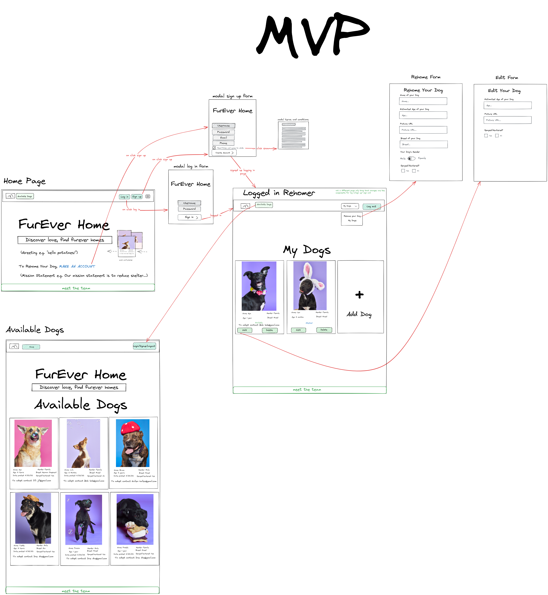

### FurEverHome

Kristian "Kallen" Allen
Rachel "Ray" Parker
Marc "Marc" Rey
Michael Martinez
Andres "Dre" Ramirez

FurEverHome - "Connecting hearts with FurEverHomes"

## Design

[API design](api-design.md)

## Intended market
We are targeting dog lovers who are wanting to adopt and re-home.

## Functionality

Visitors to the site can view available dogs to adopt and sign-up for an account that will allow them access to:

Post a dog that needs to be rehomed and the post will show them available for adoption.

Users can post their dog for adoption.
Click on their dog post to edit details.
Delete their dog post.
View their list of dogs and see who is adopted and available.

## Project Initialization
To fully enjoy this application on your local machine, please make sure to follow these steps:

"*"Clone the repository down to your local machine
"*"CD into the new project directory
"*"Run docker volume create fureverhome-db
"*"Run docker compose build
"*"Run docker compose up

# Enjoy FurEverHome to its fullest!
